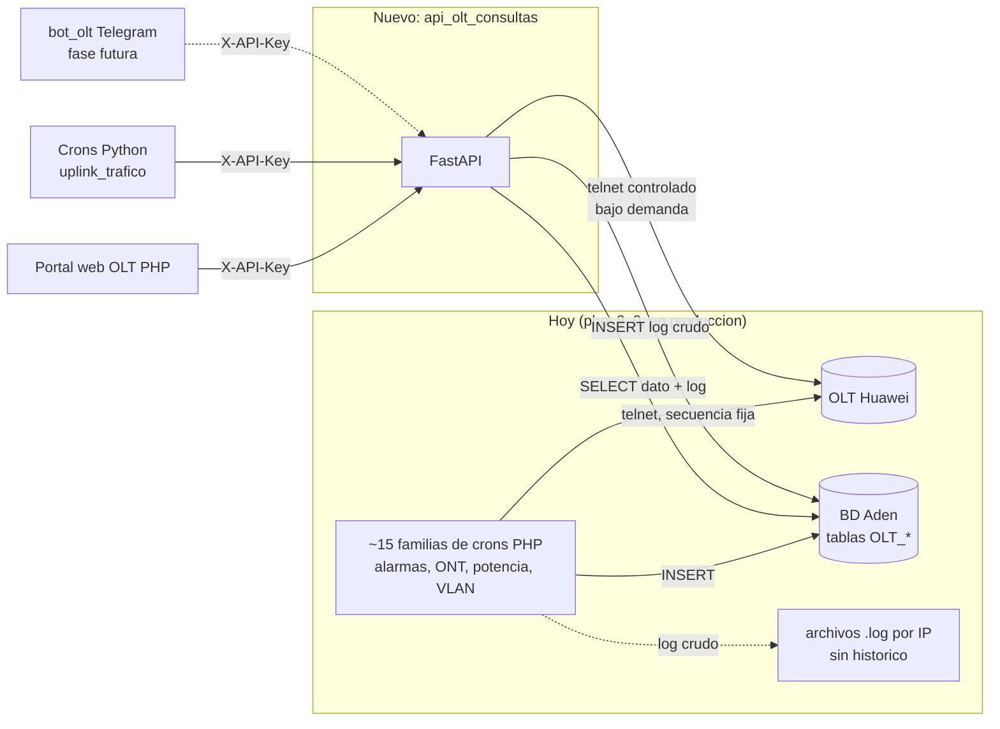
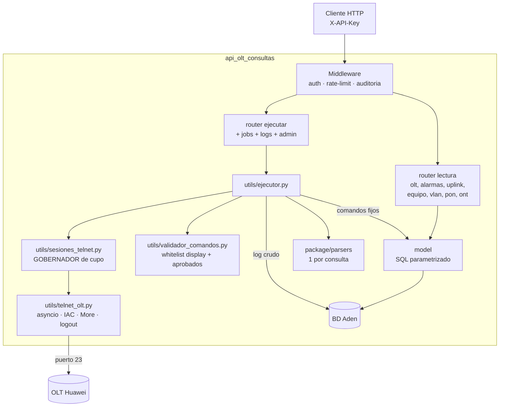
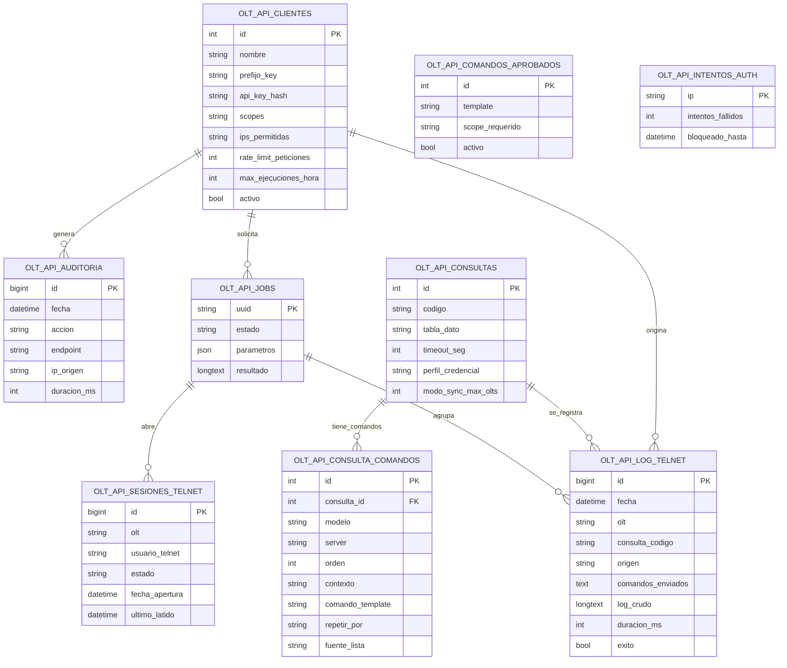
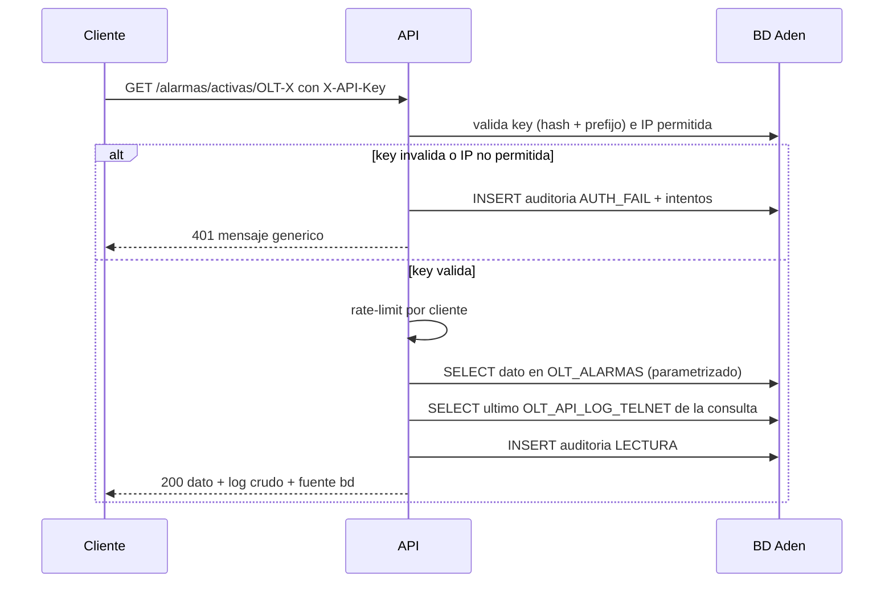
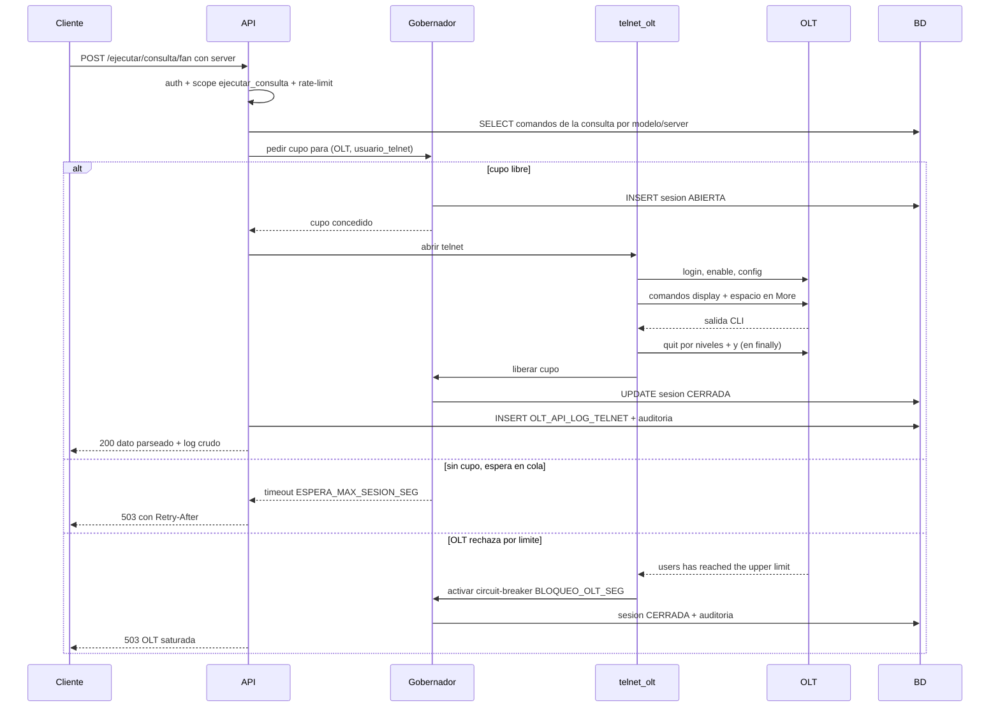
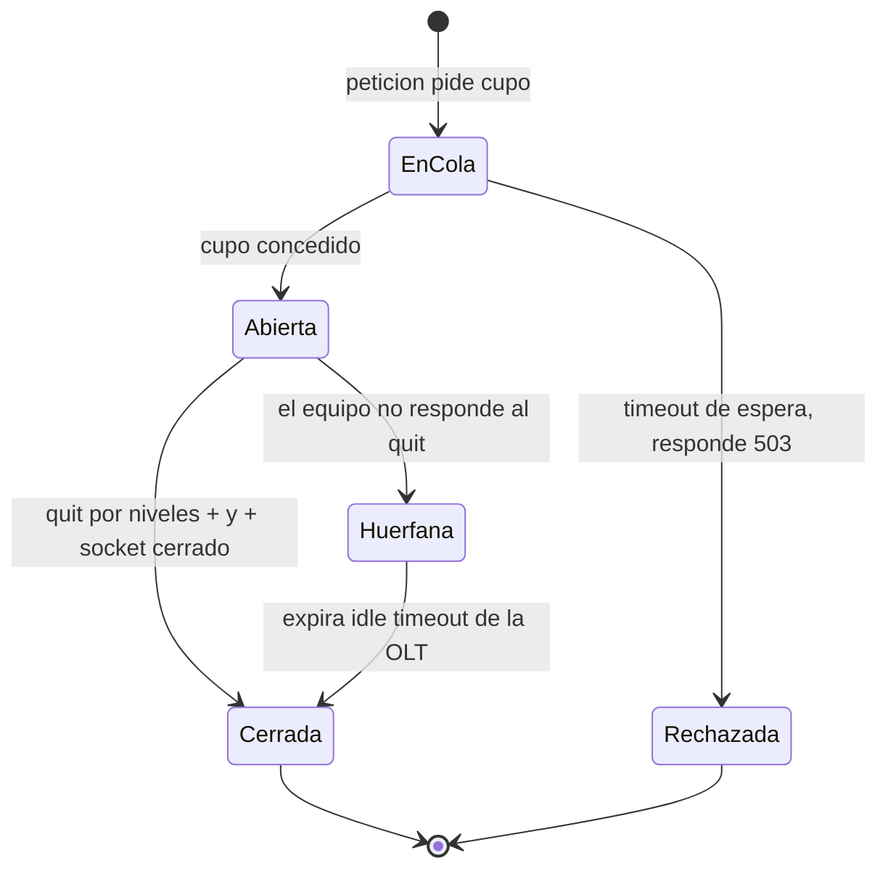
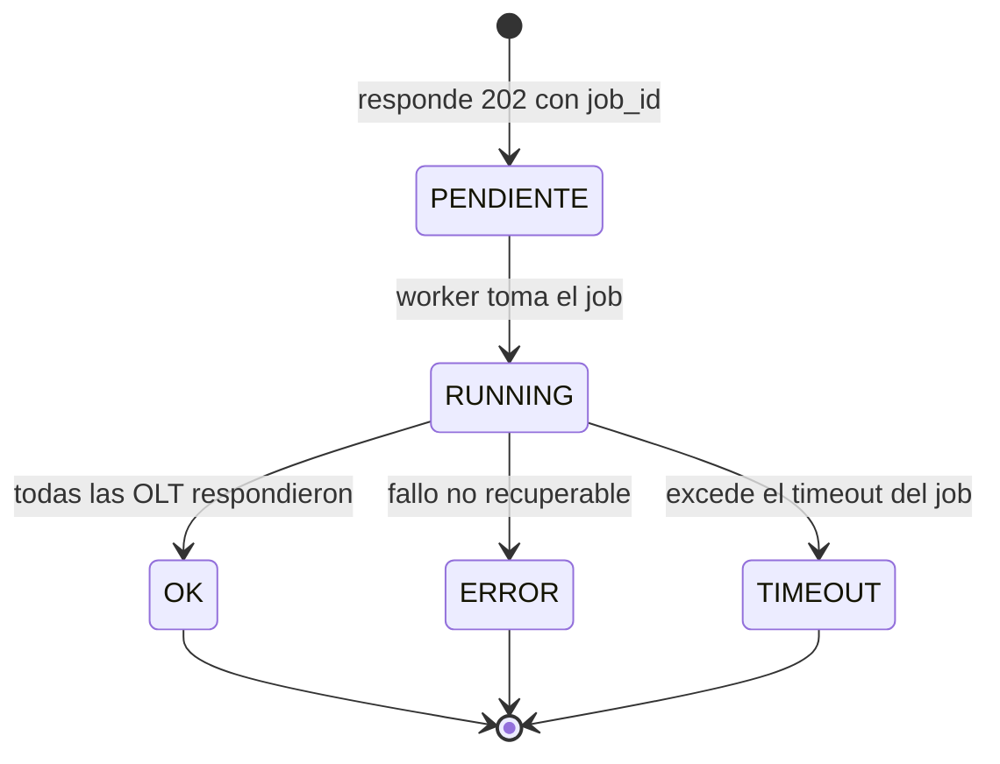
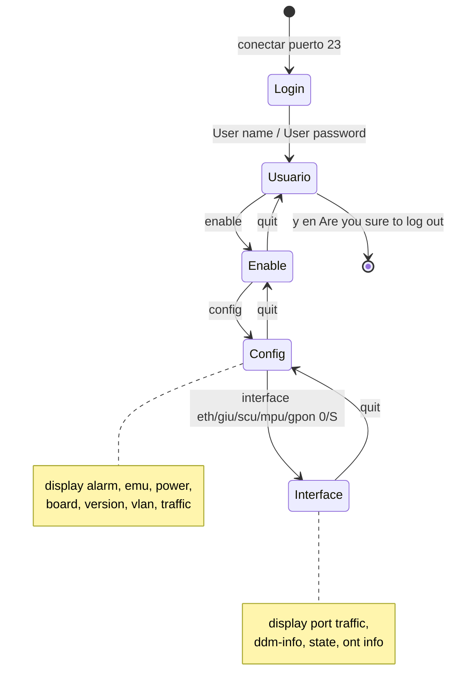

# Diagramas — `api_olt_consultas`

Diagramas Mermaid (renderizan en GitHub). **Revisados en F8**: reflejan el código
implementado (F1–F7). Lo único pendiente es F9 (validación con equipos reales) y F10
(despliegue), que no cambian la arquitectura. Para el detalle de cada componente ver
[`MANUAL_DESARROLLADOR.md`](MANUAL_DESARROLLADOR.md).

> Middlewares (orden real, de más externo a más interno):
> `hardening` (request-id, límite de body, cabeceras de seguridad) →
> `auditoría` (LECTURA/EJECUCION/RECHAZADO) → `CORS`. Un error no controlado lo
> captura el `exception_handler` global → `500` genérico sin traza.

---

## 1. Contexto: de dónde viene esto

Hoy cada familia de procesos PHP abre su propio telnet, parsea y escribe en BD. La API
no reemplaza a los crons: **lee lo que ellos ya escribieron** y, cuando se le pide
explícitamente, abre su propia sesión telnet controlada.

---

## 2. Componentes internos

---

## 3. Modelo de datos nuevo (tablas `OLT_API_*`)

Las 248 tablas `OLT_*` existentes no se modifican: solo se leen.

---

## 4. Secuencia: lectura de un dato (sin telnet)

---

## 5. Secuencia: ejecución en vivo respetando el límite de 3 sesiones

El punto crítico del proyecto: la OLT cierra o bloquea la cuarta sesión del mismo usuario.

---

## 6. Estados de una sesión telnet

---

## 7. Estados de un job (ejecución asíncrona)

---

## 8. Contextos del CLI Huawei (lo que recorre el autómata telnet)

